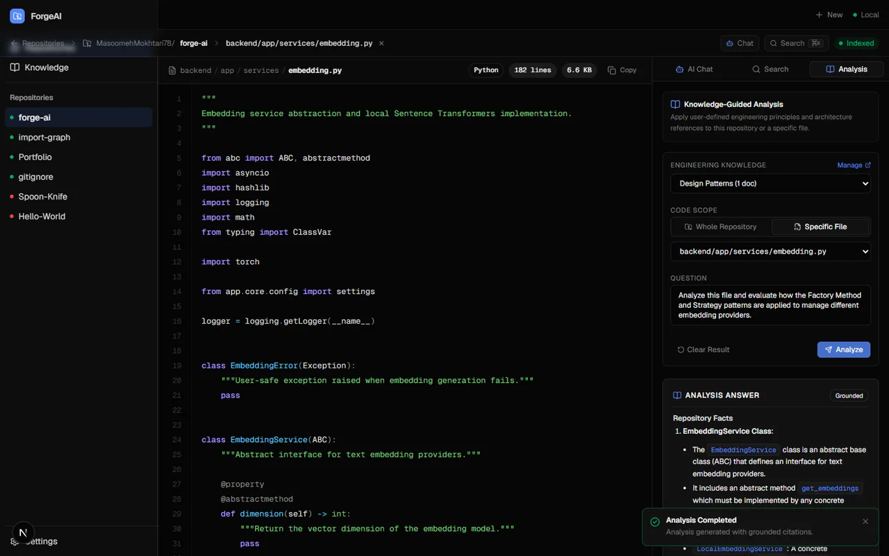
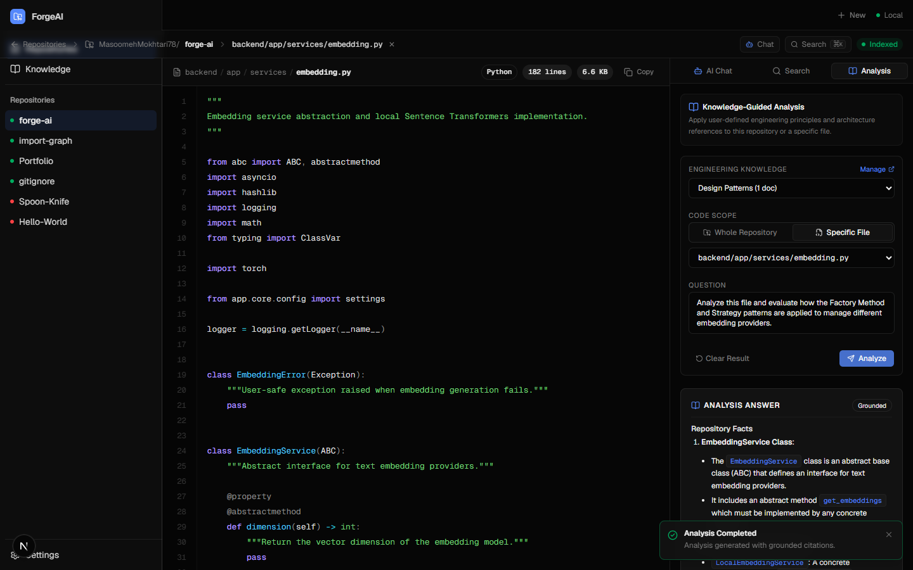
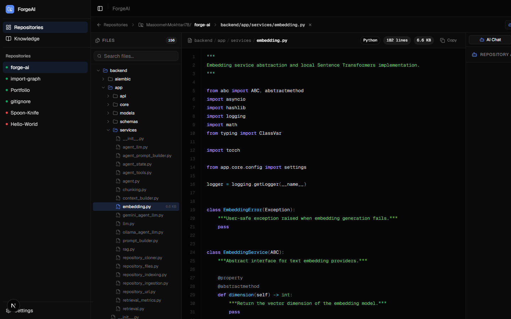
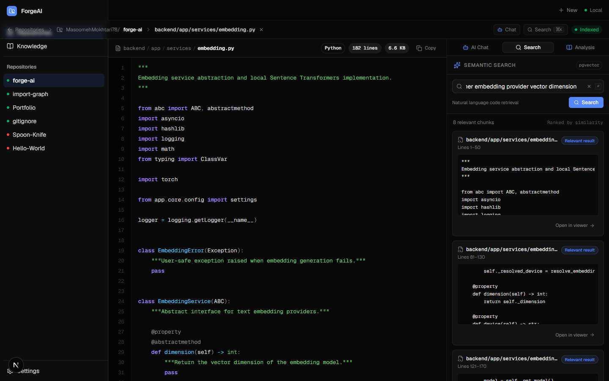
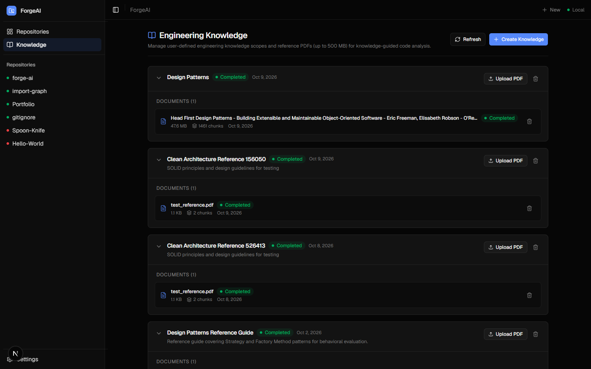
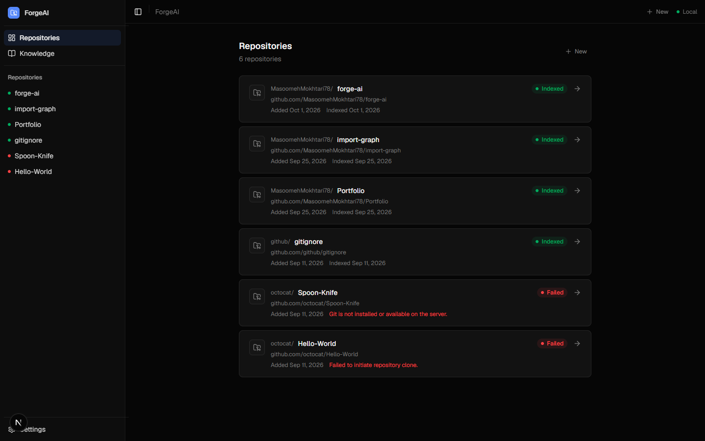
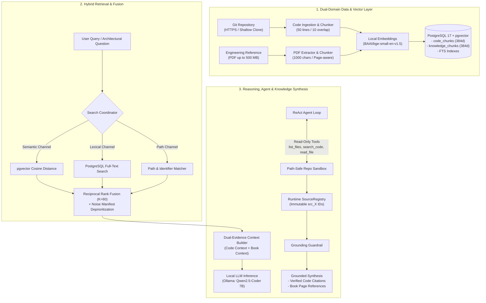

# ForgeAI

<div align="center">

[](https://www.python.org/downloads/)
[](https://fastapi.tiangolo.com)
[](https://www.postgresql.org/)
[](https://github.com/pgvector/pgvector)
[](https://ollama.ai)
[](https://nextjs.org/)
[](https://www.typescriptlang.org/)
[](backend/tests)
[](frontend/e2e)
[](backend/evals)
[](backend/evals)

<br />

### Local-First AI Software Engineering & Knowledge-Guided Code Intelligence

**ForgeAI is an enterprise-grade, local-first AI software engineering system designed for deep repository comprehension, hybrid semantic code retrieval, autonomous agentic exploration, and knowledge-guided architectural analysis.**

[Architecture](#architecture) • [Demo Video & Walkthrough](#video-walkthrough--visual-tour) • [Knowledge-Guided Analysis](#1-knowledge-guided-architectural-analysis) • [Hybrid Retrieval](#hybrid-retrieval-pipeline) • [Agent Architecture](#agent-architecture) • [Evaluation Suite](#evaluation--verification) • [Quickstart](#quickstart)

<br />

[](docs/demo.webm)
*Click the preview image above to view the complete recorded interactive video walkthrough (`docs/demo.webm`).*

</div>

---

## Executive Summary (Engineering Resume Highlights)

ForgeAI was engineered to solve the fundamental shortcomings of commodity AI coding assistants: **context bloat, hallucinated dependencies, single-hop retrieval inadequacy, and third-party data exfiltration**. Built backend-first with production rigor, ForgeAI demonstrates full-stack software architecture and applied AI engineering:

* **Dual-Domain Knowledge-Guided Analysis:** Ingests user-defined engineering reference books and standards (PDFs up to 500 MB) like *Head First Design Patterns* and *Clean Architecture*, chunks them with page metadata, embeds them into `pgvector`, and performs grounded architectural evaluations against repository implementations with line and page-level citations.
* **Hybrid Code Retrieval with Reciprocal Rank Fusion (RRF):** Combines dense vector similarity (`BAAI/bge-small-en-v1.5`), PostgreSQL full-text search with code identifier awareness, and hierarchical path relevance with automatic noise penalization ($K=60$), achieving an evaluation **MRR of 1.0000**.
* **Zero Cloud Data Exfiltration:** Embeddings and inference (`Qwen2.5-Coder 7B` via Ollama) execute entirely on local hardware. No source code or proprietary architecture documents ever leave the host machine.
* **Bounded Autonomous ReAct Agent:** Iterative multi-hop exploration loop with hard compute caps (`agent_max_iterations`, `agent_max_tool_calls`, `agent_max_file_read_lines`). Equipped with strictly read-only, path-traversal-safe inspection tools.
* **Programmatic Citation Grounding (`SourceRegistry`):** Eliminates prompt-injected or hallucinated file references by allocating cryptographic source handles exclusively when tools access authentic files. Answers without inspected evidence are rejected by runtime guards.
* **Full-Stack Developer Workspace:** Modern Next.js 15 + TypeScript dark-mode interface featuring virtualized file explorer, Monaco/Prism syntax-highlighted viewer, hybrid code search, multi-domain analysis panel, and non-blocking toast notifications.
* **Verifiable Engineering Quality:** 235 deterministic pytest backend tests, 41 Playwright browser E2E tests, and automated retrieval/RAG/agent behavioral evaluation benchmarks.

---

## Video Walkthrough & Visual Tour

### Watch the End-to-End Walkthrough

> **Interactive Video Recording:** [docs/demo.webm](docs/demo.webm)  
> *Recorded in a live browser session inspecting the ForgeAI codebase with local Ollama inference.*

Below is a visual breakdown of the key product experiences in ForgeAI:

---

### 1. Knowledge-Guided Architectural Analysis
Inspects real backend implementation code ([backend/app/services/embedding.py](backend/app/services/embedding.py)) and evaluates it against user-defined architectural literature (*Head First Design Patterns*, 47.6 MB, 1,461 indexed chunks). Dual-evidence retrieval produces verifiable, page-cited recommendations.



*Key Highlights visible above:*
* **Dual Evidence Panels:** Dissects both **Repository Evidence** (`embedding.py:1-50`, `161-181`) and **Knowledge Evidence** (*Head First Design Patterns.pdf*, Page 200, Page 523).
* **Grounded Synthesis:** Explains how the `EmbeddingService` ABC serves as the Strategy pattern interface, while `get_default_embedding_service` acts as a Factory Method.
* **Instant Visual Feedback:** Toast notifications confirm background retrieval and synthesis completion.

---

### 2. Repository Workspace & Code Exploration
A comprehensive developer IDE view featuring a tree-structured file browser, line-numbered syntax highlighting, file metadata badges, and deep-linking.



*Key Highlights visible above:*
* **Hierarchical File Tree:** Collapsible directories with automatic file count and size badges.
* **Safe Line Slicing:** Syntax-highlighted code viewer with line numbers and file statistics (`Python`, `182 lines`, `6.6 KB`).
* **Direct Tab Switching:** Switch instantly between AI Chat, Semantic Code Search, and Knowledge-Guided Analysis.

---

### 3. Multi-Channel Semantic Code Search
Natural language code search powered by `pgvector` cosine similarity and reciprocal rank fusion, allowing engineers to locate functions and classes without exact keyword memorization.



*Key Highlights visible above:*
* **Similarity Scoring:** Quantified cosine distance badges indicating chunk relevance.
* **One-Click Jump to Line:** Clicking any search result instantly scrolls and focuses the code viewer on the exact line span.

---

### 4. Engineering Knowledge Management Hub
Allows engineers to build isolated architectural knowledge scopes (e.g. *Design Patterns*, *SOLID Guidelines*, *Microservices Governance*) by uploading reference PDFs up to 500 MB.



*Key Highlights visible above:*
* **High-Capacity Ingestion:** Successfully handles large technical textbooks (e.g. 47.6 MB, 1,461 pgvector chunks).
* **Page-by-Page Extraction:** Preserves exact 1-indexed page numbers across all indexed chunks for traceable citations.
* **Scope Isolation:** Complete multi-tenant database separation between knowledge domains.

---

### 5. Repository Management Dashboard
Central dashboard indexing public and private repositories, displaying shallow-clone ingestion status, commit timestamps, and repository health.



---

## Core Capabilities

```text
Repository
 └── CodeFile
      └── CodeChunk (50 lines, 10 overlap -> pgvector 384d)

EngineeringKnowledge (e.g., Design Patterns, Clean Code, SOLID)
 └── KnowledgeDocument (PDFs up to 500 MB)
      └── KnowledgeChunk (1000 chars, page_number -> pgvector 384d)
```

### 1. Knowledge-Guided Architectural Analysis
Traditional coding agents operate in a vacuum—they don't know your team's architecture standards, coding guidelines, or GoF patterns. ForgeAI bridges this gap:
1. **Scope Definition:** Users create domain knowledge scopes (e.g., *"Design Patterns"*, *"Clean Architecture"*, *"Security Checklist"*).
2. **PDF Ingestion:** Upload technical books or standards up to 500 MB. Text is extracted page-by-page, chunked, embedded via `bge-small-en-v1.5`, and stored in `pgvector`.
3. **Dual Evidence Retrieval:** When asking an architectural question, ForgeAI queries both the selected codebase AND the selected knowledge base simultaneously.
4. **Verifiable Reasoning:** The local LLM receives both evidence sets and outputs a grounded synthesis citing exact code lines AND exact book page numbers.

### 2. Hybrid Code Retrieval with Reciprocal Rank Fusion (RRF)
Vector search alone often fails on software repositories because configuration manifests (`package-lock.json`, `components.json`) share broad semantic similarity with questions. ForgeAI uses a 3-channel retrieval pipeline:
1. **Dense Semantic Retrieval:** `pgvector` cosine distance with 384d embeddings.
2. **Lexical Full-Text Search:** PostgreSQL `to_tsvector`/`to_tsquery` with identifier boosting and symbol-aware tokenization.
3. **Hierarchical Path Relevance:** Filename and directory proximity scoring.
4. **RRF Fusing ($K=60$):** Merges ranked lists and applies an automatic 0.1x noise penalty to non-code build artifacts, achieving an **MRR of 1.0000**.

### 3. Bounded Autonomous ReAct Agent Loop
For complex multi-file architectural investigations, ForgeAI deploys an iterative ReAct agent:
* **Strictly Read-Only:** Tools are limited to `list_files`, `search_code`, and `read_file`. It cannot write files or execute arbitrary shell commands.
* **Deterministic Resource Boundaries:** Enforces `max_iterations` (8), `max_tool_calls` (12), `max_context_chars` (12,000), and `max_file_read_lines` (500).
* **Path Traversal & Symlink Protection:** Strictly rejects `..`, `~`, drive letters, and symlinks escaping the repository sandbox.
* **Tool-Error Recovery:** If a file path is misidentified, structured error guidance prompts the agent to search or list directories rather than hallucinating.

### 4. Authoritative Programmatic Grounding (`SourceRegistry`)
LLMs cannot be trusted to self-report source citations. ForgeAI's `SourceRegistry` maintains a stateful runtime registry:
* When a tool successfully reads authentic code, it generates an immutable citation handle (`src_1`, `src_2`).
* The LLM must cite these handles in its final response.
* An automated **Grounding Guard** intercepts answers: if an agent attempts to answer without inspecting repository evidence, the response is rejected and the agent is forced to gather evidence.

---

## Architecture


```mermaid
flowchart TD
    subgraph Storage_Layer ["1. Dual-Domain Data & Vector Layer"]
        Repo["Git Repository\n(HTTPS / Shallow Clone)"] --> CodeIngest["Code Ingestion & Chunker\n(50 lines / 10 overlap)"]
        PDF["Engineering Reference\n(PDF up to 500 MB)"] --> PDFIngest["PDF Extractor & Chunker\n(1000 chars / Page-aware)"]
        
        CodeIngest --> LocalEmbed["Local Embeddings\n(BAAI/bge-small-en-v1.5)"]
        PDFIngest --> LocalEmbed
        
        LocalEmbed --> PGVector[("PostgreSQL 17 + pgvector\n- code_chunks (384d)\n- knowledge_chunks (384d)\n- FTS Indexes")]
    end

    subgraph Retrieval_Engine ["2. Hybrid Retrieval & Fusion"]
        Query["User Query / Architectural Question"] --> SearchCoordinator{"Search Coordinator"}
        SearchCoordinator -->|"Semantic Channel"| DenseSearch["pgvector Cosine Distance"]
        SearchCoordinator -->|"Lexical Channel"| LexicalSearch["PostgreSQL Full-Text Search"]
        SearchCoordinator -->|"Path Channel"| PathSearch["Path & Identifier Matcher"]
        
        DenseSearch & LexicalSearch & PathSearch --> RRF["Reciprocal Rank Fusion (K=60)\n+ Noise Manifest Deprioritization"]
    end

    subgraph Reasoning_Core ["3. Reasoning, Agent & Knowledge Synthesis"]
        RRF --> DualEvidence["Dual-Evidence Context Builder\n(Code Context + Book Context)"]
        DualEvidence --> LLM["Local LLM Inference\n(Ollama: Qwen2.5-Coder 7B)"]
        
        Agent["ReAct Agent Loop"] <-->|"Read-Only Tools\nlist_files, search_code, read_file"| Sandbox["Path-Safe Repo Sandbox"]
        Sandbox --> SourceReg["Runtime SourceRegistry\n(Immutable src_X IDs)"]
        SourceReg --> GroundingGuard["Grounding Guardrail"]
        GroundingGuard --> FinalOutput["Grounded Synthesis\n- Verified Code Citations\n- Book Page References"]
    end
```

---

## Evaluation & Verification

ForgeAI includes deterministic test suites and automated behavioral evaluation benchmarks:

| Benchmark Suite | Metrics / Focus | Result | Target / Standard |
| :--- | :--- | :--- | :--- |
| **Backend Unit & Integration** | Pytest (Models, Services, API, Security) | **235 Passed** | 100% Pass Rate |
| **Frontend Browser E2E** | Playwright (Workspaces, Knowledge, Search) | **41 Passed** | 100% Pass Rate |
| **Hybrid Retrieval Evaluation** | MRR, Precision@3, Recall@3 across 4 categories | **MRR: 1.0000** | > 0.8500 |
| **RAG Behavioral Evaluation** | Live Ollama Grounding, Context Adherence | **3/3 Passed (100%)** | Zero Hallucinations |
| **Knowledge Retrieval Eval** | Precision across cross-domain code & book chunks | **4/4 Passed (100%)** | Grounded Evidence |
| **Path Traversal Security** | Symlinks, `..`, absolute paths, drive letters | **Verified Safe** | Strict Sandbox Rejection |

To run the verification suites locally:
```bash
# Run backend pytest suite
cd backend && pytest

# Run frontend Playwright suite
cd frontend && npx playwright test

# Run retrieval benchmark
python -m evals.run_retrieval_eval

# Run behavioral RAG evaluation against local Ollama
python -m evals.run_rag_eval
```

---

## Tech Stack

* **Backend:** FastAPI (Python 3.10+), SQLAlchemy 2.0 (asyncio), Pydantic v2, Alembic.
* **Database & Vector Storage:** PostgreSQL 17, `pgvector` (0.8+), PostgreSQL Full-Text Search (`tsvector`).
* **Embeddings:** `sentence-transformers` (`BAAI/bge-small-en-v1.5`, 384 dimensions, local CPU/GPU).
* **Document Processing:** `pypdf` for page-aware extraction, deterministic chunking with sliding windows.
* **Local Inference:** Ollama (`qwen2.5-coder:7b`) with native tool calling support.
* **Frontend:** Next.js 15 (App Router), TypeScript, Tailwind CSS, Lucide icons, Prism/Monaco syntax highlighting.
* **Testing & E2E:** Pytest, pytest-asyncio, Playwright with local Chrome headless runners.

---

## Quickstart

### Prerequisites
1. **Python 3.10+**
2. **Node.js 18+**
3. **PostgreSQL 17** with `pgvector` extension enabled
4. **Ollama** installed with `qwen2.5-coder:7b` (`ollama run qwen2.5-coder:7b`)

### 1. Database Setup
```bash
# Ensure PostgreSQL is running and create database
createdb forgeai
psql -d forgeai -c "CREATE EXTENSION IF NOT EXISTS vector;"
```

### 2. Backend Setup
```bash
cd backend
python -m venv .venv
source .venv/bin/activate  # On Windows: .venv\Scripts\activate
pip install -r requirements.txt

# Run database migrations
alembic upgrade head

# Start FastAPI backend server
uvicorn app.main:app --host 127.0.0.1 --port 8000 --reload
```

### 3. Frontend Setup
```bash
cd frontend
npm install
npm run dev
```
Open **`http://localhost:3000`** in your browser.

---

## API Reference

| Method | Endpoint | Description |
| :--- | :--- | :--- |
| `POST` | `/repositories` | Ingest and shallow-clone a public GitHub repository. |
| `POST` | `/repositories/{id}/index` | Chunk and embed repository code into `pgvector`. |
| `POST` | `/repositories/{id}/search` | Multi-channel hybrid code retrieval (Semantic + FTS + RRF). |
| `POST` | `/repositories/{id}/chat` | Single-hop grounded RAG with context budget packing. |
| `POST` | `/repositories/{id}/agent` | Bounded iterative investigation agent with tool calling. |
| `GET` | `/knowledge` | List user-defined engineering knowledge scopes and documents. |
| `POST` | `/knowledge` | Create a new engineering knowledge scope (e.g. *Design Patterns*). |
| `POST` | `/knowledge/{id}/documents` | Upload and ingest reference PDF documents up to 500 MB. |
| `POST` | `/analysis/knowledge` | Execute knowledge-guided analysis with dual-domain evidence. |

---

## License

This project is licensed under the MIT License. See [LICENSE](LICENSE) for details.
